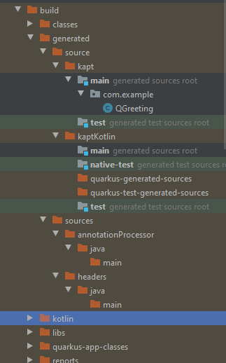
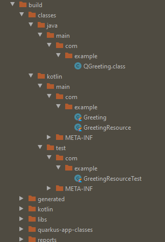

# quarkus-kotlin-querydsl project

Demonstration of a problem when using QueryDSL in a Gradle Kotlin Quarkus service. 
I am using Quarkus 1.9.2.Final, Gradle 6.5.1, Kotlin 1.3.72 and targeting JVM version 11.
This demonstration project was generated using https://code.quarkus.io/

Running quarkusDev and making a request, thus accessing the database with QueryDSL produces no error.

Running tests on the other hand results in the following errormessage:

_ERROR: HTTP Request to /resteasy/hello failed, error id: 4e94e4d9-5818-424e-81f6-b604ff10205e-1_

_org.jboss.resteasy.spi.UnhandledException: java.lang.ClassCastException: class com.querydsl.core.types.dsl.StringPath cannot be cast to class com.querydsl.core.types.Expression (com.querydsl.core.types.dsl.StringPath is in unnamed module of loader 'app'; com.querydsl.core.types.Expression is in unnamed module of loader io.quarkus.bootstrap.classloading.QuarkusClassLoader @1d1a9477)_

The Resource tested is fairly simple:

```kotlin
@Path("/resteasy/hello")
class GreetingResource @Inject constructor(val em: EntityManager) {

    @GET
    @Produces(MediaType.TEXT_PLAIN)
    fun hello(): String {
        val qGreeting = QGreeting.greeting

        val queryFactory = JPAQueryFactory(em)

        val greeting = queryFactory
                .select(qGreeting.text)
                .from(qGreeting)
                .fetchFirst()

        return greeting ?: "Default greeting"
    }
}
```

The one test failing is written using @QuarkusTest, @DBRider and RestAssured:

```kotlin
@QuarkusTest
@DBRider
class GreetingResourceTest {

    @DataSet(value = ["greetings.yml"])
    @Test
    fun testHelloEndpoint() {
        given()
          .`when`().get("/resteasy/hello")
          .then()
             .statusCode(200)
             .body(`is`("Hello World"))
    }

}
```

Here's the Entity for completeness:
```kotlin
@Entity
@Table
class Greeting {

    @Column(name = "text", length = 100)
    var text: String? = null

    @Column(name = "id", length = 36)
    @Id
    @GeneratedValue(generator = "GreetingPKGen")
    @GenericGenerator(name = "GreetingPKGen", strategy = "uuid2")
    var id: String? = null
}
```

Here's the _/build/generated_ folder:



Here's the _/build/classes_ folder:




This project uses Quarkus, the Supersonic Subatomic Java Framework.

If you want to learn more about Quarkus, please visit its website: https://quarkus.io/ .

## Running the application in dev mode

You can run your application in dev mode that enables live coding using:
```shell script
./gradlew quarkusDev
```

## Packaging and running the application

The application can be packaged using:
```shell script
./gradlew build
```
It produces the `quarkus-kotlin-querydsl-1.0.0-SNAPSHOT-runner.jar` file in the `/build` directory.
Be aware that it’s not an _über-jar_ as the dependencies are copied into the `build/lib` directory.

If you want to build an _über-jar_, execute the following command:
```shell script
./gradlew build -Dquarkus.package.type=uber-jar
```

The application is now runnable using `java -jar build/quarkus-kotlin-querydsl-1.0.0-SNAPSHOT-runner.jar`.

## Creating a native executable

You can create a native executable using: 
```shell script
./gradlew build -Dquarkus.package.type=native
```

Or, if you don't have GraalVM installed, you can run the native executable build in a container using: 
```shell script
./gradlew build -Dquarkus.package.type=native -Dquarkus.native.container-build=true
```

You can then execute your native executable with: `./build/quarkus-kotlin-querydsl-1.0.0-SNAPSHOT-runner`

If you want to learn more about building native executables, please consult https://quarkus.io/guides/gradle-tooling.

# RESTEasy JAX-RS

Guide: https://quarkus.io/guides/rest-json


